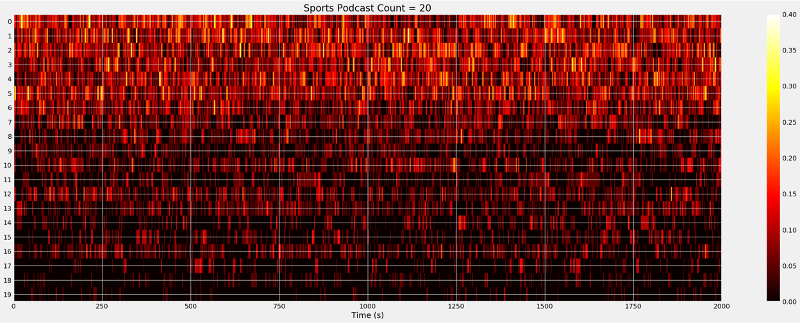

# Unlocking More From Your Audio Data!
### By Braden Riggs | @bradenriggs1
---

In a world where content capture and creation sits in your pocket, the amount of audio collected and stored has exploded exponentially in recent years creating a goldmine of unstructured data ready to be explored and used. Just one problem, how do we work with all of this audio data and how do we make sure we are utilizing it to its full potential? In this talk we will explore how you can unlock more from your audio data in python, exploring some of our favorite data extraction and analysis tools and how we used them to better understand the world of podcast creation.

As part of the Dolby.io (https://dolby.io/) team we regularly work with audio data for a variety of data science related projects and are eager to share some of the tips, tricks and tools we've learnt along the way that can help audio data beginners get started and inspire seasoned veterans to rethink how they work in the space.

Demo notebooks presented at PyData Global 2021 and SciPy LatAm 2021 for "Unlocking more from your audio data".

[Full Talk](https://zoom.us/rec/play/O9NYrLk4ZndslxJ2_ijIYVSeAIsEjxbWHny4pQ3eEKnS1KxQmf7fBgWtCWdwIcALEeqfIr8m7vui0skq.Pm2hVyYmg2gh6-Bs?startTime=1635606149000&_x_zm_rtaid=LdnvL0qCQF6bI7hS8vVh5Q.1635638331701.c3802c6048b02acbb4e8082f84565a4c&_x_zm_rhtaid=916&fbclid=IwAR3DKec0mhHU9sPd_KIbZvr8a0haiIrXk03PXM05RuK7lMqWP21PFd0Fj3s)

Join Awesome Audio: https://github.com/DolbyIO/awesome-audio
